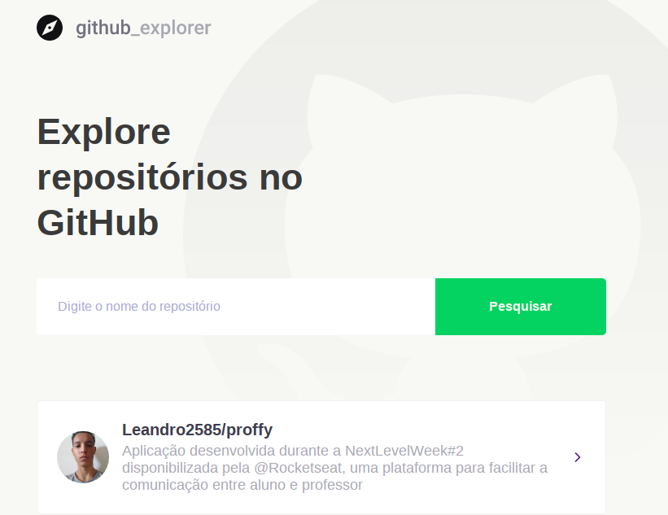
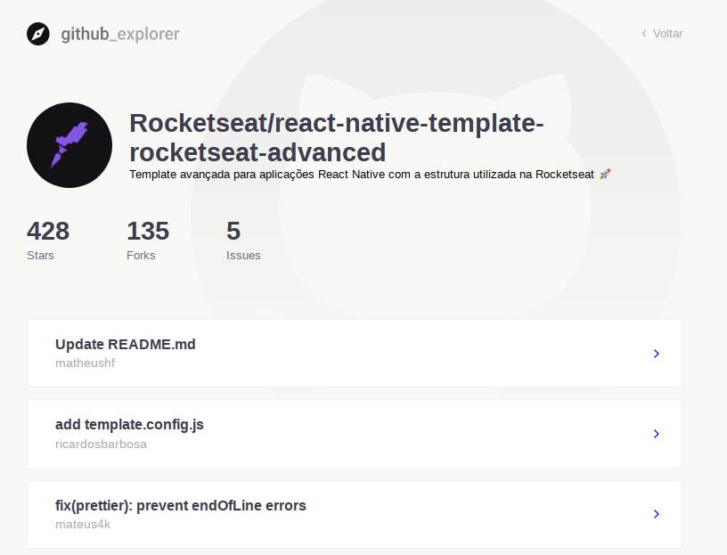

<h1 align="center">GitHub Explorer</h1>
<h2 title="Páginas">📌 Sobre</h2>
<p align="left">
Explore repositórios do github a partir dessa aplicação de maneira fácil e dinâmica
</p>

<h2>Páginas Web</h2>
<h3>Dashboard</h3>
<p align="center">
      
</p>
<h3>Repository</h3>
<p align="center">
      
</p>

<h2>📋 Pré-requisitos</h2>
Para começar você vai precisar ter as seguintes ferramentas em sua máquina:
[Git](https://git-scm.com), [Node.js](https://nodejs.org/en/).
Também precisará de um editor para trabalhar com o código.

<h2>▶️ Rodando o projeto</h2>

``` bash
# Clone o repositório
$ git clone <https://github.com/Leandro2585/git_explorer>

# Acesse o diretório do projeto via terminal
$ cd git_explorer

# Instale as dependências
$ npm install

# Execute a aplicação web
$ npm run start

# O serviço ficará disponível na porta: 3000 - para acessá-la use: <localhost:3000>

```
<br/>

<h2>⚙️ Funcionalidades</h2>

- [x] Pesquisa por repositórios a partir do nome. Ex: autor/repo_name <br>
- [x] Detalhes do repositório<br>
- [x] Issues do repositório especificado<br>

<h2>💡 Tecnologias</h2>
As ferramentas utilizadas no desenvolvimento desse projeto foram:
- [React](https://pt-br.reactjs.org/)
- [Typescript](https://typescriptlang.org/)

 <br/> Entre em contato comigo:<br/> [](https://www.linkedin.com/in/leandro-r-434b811a5/)
|
[](mailto:leo.real2585@gmail.com)

[](https://opensource.org/licenses/MIT)
